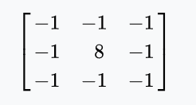

# Cuda Convolution Examples

## Introduction
This project has some examples of CUDA forward convolution and the purpose is to investiage some features of CUDA.

Developed based on: [http://www.goldsborough.me/cuda/ml/cudnn/c++/2017/10/01/14-37-23-convolutions_with_cudnn/](http://www.goldsborough.me/cuda/ml/cudnn/c++/2017/10/01/14-37-23-convolutions_with_cudnn/)

An edge detector is taken as an example for the forward convolution.

The **/conv_cudnn** directory has the cudnn version of edge detector as the reference.

The **/direct** directoy has some implementations of direct convolution. Starting from CPU convolution and naive CUDA solution, we can see how some CUDA features can accelerate the forward convolution task.

## Sample 

Filter being used across rgb channels:

Edge Dectector result:

## Specs

* CPU: I5-7600K
* GPU: GTX1070
* CUDA version: 10.0
* CUDNN Version: 7.6.5

## Cudnn Result

[CUDNN Forward convolution algorithms](https://docs.nvidia.com/deeplearning/cudnn/api/index.html#cudnnConvolutionFwdAlgo_t)

Cudnn convolution kernel time in second:

|  FWD_ALGO \ Image Size | 780x585 | 2000x1000 | 4000x3000 |
|-----------------------|---------|-----------|-----------|
| IMPLICIT_GEMM         | 6229e-4 | 2553e-3   | 1663e-2   |
| IMPLICIT_PRECOMP_GEMM | 4310e-4 | 1828e-3   | 1118e-2   |
| GEMM                  | 6909e-4 | 2851e-3   | 2002e-2   |
| WINOGRAD              | 6690e-4 | 2878e-3   | 1741e-2   |

Note: The algorithm given by (_cudnnGetConvolutionForwardAlgorithm_) andd **CUDNN_CONVOLUTION_FWD_PREFER_FASTEST** in this device is : **CUDNN_CONVOLUTION_FWD_ALGO_IMPLICIT_PRECOMP_GEMM**

## Direct Solution