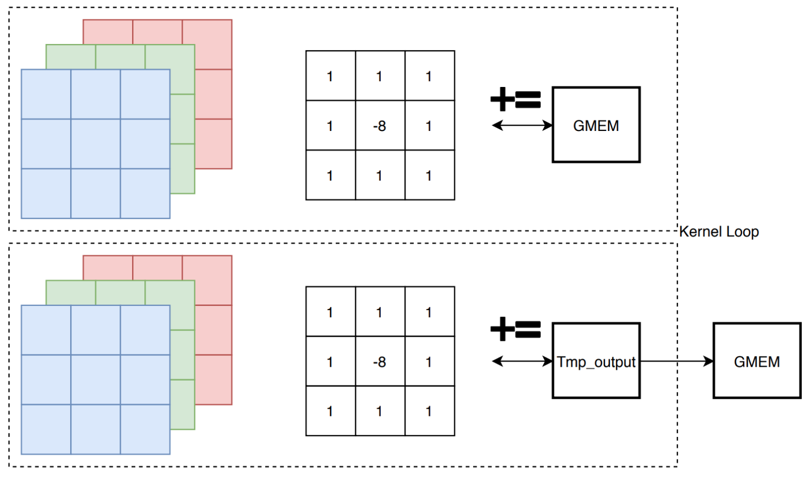
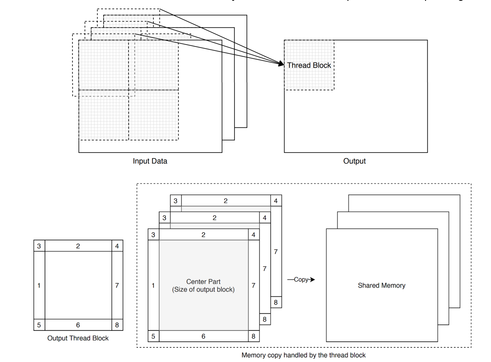
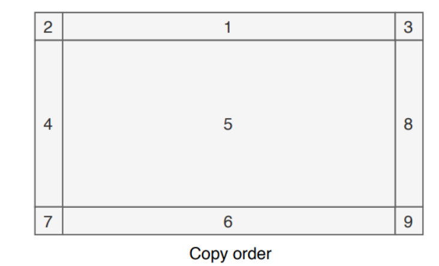

# CUDA Convolution Test

## Introduction
This project has some examples of CUDA forward convolution and the purpose is to investiage some features of CUDA.

Developed based on: [http://www.goldsborough.me/cuda/ml/cudnn/c++/2017/10/01/14-37-23-convolutions_with_cudnn/](http://www.goldsborough.me/cuda/ml/cudnn/c++/2017/10/01/14-37-23-convolutions_with_cudnn/)

An edge detector is taken as an example for the forward convolution.

The **/conv_cudnn** directory has the CUDNN version of edge detector as the reference.

The **/direct** directoy has some examples of direct convolution. Starting from CPU convolution and naive CUDA solution, we can see how some CUDA features can accelerate the forward convolution task.

## Sample 

Filter being used across rgb channels:

Edge Dectector result:

## Specs

* CPU: I5-7600K
* GPU: GTX1070
* CUDA version: 10.0
* CUDNN Version: 7.6.5

## CUDNN Result

<pre>
    mkdir conv_cudnn_build
    cd conv_cudnn_build

    cmake ../conv_cudnn
    make 

    ./conv_cudnn_3x3 ../images/780x585.jpg
</pre>

[CUDNN Forward convolution algorithms](https://docs.nvidia.com/deeplearning/cudnn/api/index.html#cudnnConvolutionFwdAlgo_t)

Cudnn convolution kernel time in second:

|  FWD_ALGO \ Image Size | 780x585 | 2000x1000 | 4000x3000 |
|-----------------------|---------|-----------|-----------|
| IMPLICIT_GEMM         | 6229e-4 | 2553e-3   | 1663e-2   |
| IMPLICIT_PRECOMP_GEMM | 4310e-4 | 1828e-3   | 1118e-2   |
| GEMM                  | 6909e-4 | 2851e-3   | 2002e-2   |
| WINOGRAD              | 6690e-4 | 2878e-3   | 1741e-2   |

Note: The algorithm given by (_cudnnGetConvolutionForwardAlgorithm_) and **CUDNN_CONVOLUTION_FWD_PREFER_FASTEST** in this device is : **CUDNN_CONVOLUTION_FWD_ALGO_IMPLICIT_PRECOMP_GEMM**

## Direct Solution

### CPU solution (/direct/conv_cpu.cu)
<pre>
    mkdir direct_build
    cd direct_build
    cmake ../direct
    make 
    ./conv_cpu_test ../images/780x585.jpg
</pre>

CPU time for edge detector task:
| Image Size | 780x585 | 2000x1000 | 4000x3000 |
|-----------------------|---------|-----------|-----------|
| CPU       | 2304e-1 | 1.101  | 6.070   |

### CUDA naive solution (/direct/conv_cuda_naive.cu)
Naive CUDA solution with parallel loops.

<pre>
    ./conv_cuda_naive ../images/780x585.jpg
</pre>

Kernel time :
|  Image Size | 780x585 | 2000x1000 | 4000x3000 |
|-----------------------|---------|-----------|-----------|
| CUDA Naive       | 1746e-3 | 7591e-3  | 4649e-2   |

### CUDA solution + register output(/direct/conv_cuda_reg_nopad.cu)

Added register for block output, reduce writing to global memory access.

<pre>
    ./conv_cuda_reg_out ../images/780x585.jpg
</pre>

Kernel time :
|  Image Size | 780x585 | 2000x1000 | 4000x3000 |
|-----------------------|---------|-----------|-----------|
| Kernel time     | 1126e-3 | 4803e-3  | 2995e-2   |

### CUDA solution + SMEM + register output (/direct/conv_cuda_smem_nopad.cu)

Due to multiple read access to the overlapped areas, could be acclerated by putting the input area and zeros to share memory.

The kernel function become much more compliated due to the boundary and padding checks. HOwever, with the added loops and branches, the overall kernel time is shorter.

<pre>
    ./conv_cuda_smem_out ../images/780x585.jpg
</pre>

Kernel time :
|  Image Size | 780x585 | 2000x1000 | 4000x3000 |
|-----------------------|---------|-----------|-----------|
| Kernel time     | 8249e-4 | 3399e-3  | 2085e-2   |

### CUDA solution + reorder SMEM copy + register output (/direct/conv_cuda_smem_reorder.cu)

Reorder shared memory copying order for faster GMEM access by reducing conflict between blocks. Slightly faster than the above solution.
Also, the block size 64x16 is found to be faster than 32x32.

<pre>
    ./conv_cuda_smem_reorder ../images/780x585.jpg
</pre>

Kernel time :
|  Image Size | 780x585 | 2000x1000 | 4000x3000 |
|-----------------------|---------|-----------|-----------|
| Kernel time      | 7801e-4 | 3278e-3  | 1991e-2   |

### CUDA solution + reorder SMEM copy and combine corner copy + register output (/direct/conv_cuda_smem_reorder.cu)

Combine the boundry checks in the block corners, which should reduce the branches in the CUDA kernel function.
Speed Up ~2.2 than naive CUDA solution. 
<pre>
    ./conv_cuda_smem_combine ../images/780x585.jpg
</pre>

Kernel time :
|  Image Size | 780x585 | 2000x1000 | 4000x3000 |
|-----------------------|---------|-----------|-----------|
| Kernel time     | 7789e-4 | 3274e-3  | 1997e-2   |

### *Further combining SMEM copying

Combine the top/left and bottom/right padding copying to reduce code divergence. Worked in the previous device but only work for small image size currently. 
<pre>
    ./conv_cuda_comb_further ../images/780x585.jpg
</pre>

Kernel time :
|  Image Size | 780x585 | 2000x1000 | 4000x3000 |
|-----------------------|---------|-----------|-----------|
| Kernel time     | 8130e-4 | -  | -  |

### *Constant Memory for Kernel(filter) (/direct/conv_cuda_final_cmem.cu)

The constant memory requires a known kernel size before compilation, which may not be applicable for general convolution usage.
This change boost the performance and the kernel time is getting closed to CUDNN result.

Some other techinques such as loop unrolling should also significantly improve the performance but they also required some known dimensions.
<pre>
    ./conv_cuda_smem_cmem ../images/780x585.jpg
</pre>

Kernel time :
|  Image Size | 780x585 | 2000x1000 | 4000x3000 |
|-----------------------|---------|-----------|-----------|
| Kernel time     | 4229e-4 | 1724e-3  | 1019e-2   |

